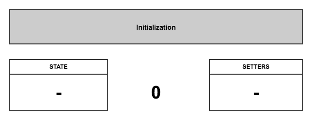
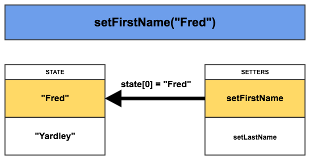
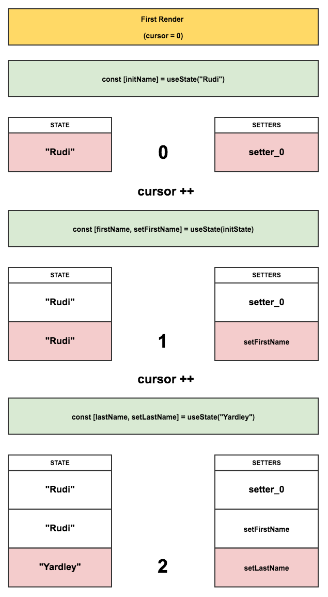

import { Head, Appear } from 'mdx-deck';
import { Split, Invert } from 'mdx-deck/layouts';
import { SplitInvert } from './layouts';
import ListItem from './components/ListItem';

export { default as theme } from './theme';

<Head>
  <title>React Hooks</title>
</Head>

# React Hooks

### All the React, None of the Class

## 😎

---

## What are hooks?

- replacement for Higher-Order Components & render props
- stateful lifecycle methods for functional components

---


---


---

## Why hooks?

<ul>
  <Appear>
    <ListItem>easier code reuse</ListItem>
    <ListItem>more composable logic</ListItem>
    <ListItem>less boilerplate</ListItem>
    <ListItem>more legible code</ListItem>
    <ListItem>lower learning curve</ListItem>
    <ListItem>better separation of concerns</ListItem>
  </Appear>
</ul>

```notes
- easier code reuse
- more composable logic
- less boilerplate
- more legible code
- lower learning curve
- better separation of concerns
```

---

## Why hooks for your code?

<ul>
  <Appear>
    <ListItem>no breaking changes</ListItem>
    <ListItem>smaller bundle sizes</ListItem>
    <ListItem>lower overhead</ListItem>
    <ListItem>cross-cutting concerns</ListItem>
    <ListItem>no deep component tree nesting</ListItem>
  </Appear>
</ul>

```notes
- no breaking changes
- smaller bundle sizes
- lower overhead
- cross-cutting concerns (stuff that's relevant to multiple distinct parts of the app)
- no deep component tree nesting
```

---


---

## Meet the Hooks

- useState
- useEffect
- useContext

---

### Yes, there are other hooks.

- useReducer
- useCallback
- useMemo
- useRef

---

### The "you'll know when you need these" hooks

- useImperativeHandle
- useLayoutEffect
- useDebugValue

```notes
- useImperativeHandle was originall useImperativeMethods
```

---

## Object destructuring

You've likely seen object destructuring if you work with React

```
function MyComponent({ name }) { /*...*/ };

const MyComponent = ({ name }) => ( /*...*/ );

const OtherComponent = props => ( /*...*/ props.name /*...*/ );
```

```notes
- introduced in ES6
```

---

## Object destructuring

```
const obj = {
  foo: "foo",
  bar: 0,
};

const { foo, bar } = obj; // foo = "foo", bar = 0

const { baz = "baz" } = obj; // default value for baz = "baz"

const { foo, ...rest } = obj; // rest = { bar: 0 }

const { foo: renamedFoo } = obj; // renamedFoo = "foo"
```

```notes
- default values
- rest spread operator
- difficult to rename
```

---

## Array destructuring?

Array destructuring is very similar, just with Arrays instead of Objects

```
const arr = [1, 2, 3];

const [foo, bar] = arr; // foo = 1, bar = 2

const [foo, bar, baz, qux = 10]; // default value for qux = 10

const [fee, fii, fum] = arr; // fee = 1, fii = 2, fum = 3

const [ack, ...rest] = arr; // rest = [2, 3]
```

```notes
- default values
- choose your own variable names (easier than renaming fields in obj. dest.)
- rest spread operator
```

---

```
function Return3() {
  return 3;
}

function Return4And5() {
  return [4, 5];
}

function ReturnFooAndBar() {
  return {
    foo: "foo",
    bar: "bar",
  };
}

function main() {
  const three = Return3();
  const [four, five] = Return4And5();
  const { foo, bar } = ReturnFooAndBar();
}
```

```notes
- how to return multiple values from a function
```

---

## Hooks syntax

- must only be called from top-level
- must not be called conditionally
- must be prefixed with `use`

```
import React, { useState } from 'react';

function MyComponent() {
  const [name, setName] = useState("Aaron");

  return (
    <div>
      {name}
    </div>
  );
}
```

```notes
- typeof name: typeof "Aaron" (string)
- typeof setName: (newName: string) => void
```

---

## Hooks syntax: ESLint rule

```
npm install -D eslint-plugin-react-hooks
```

- no conditional hooks
- recommended hook dependencies (in development)

---

## So... why array destructuring?

```
// NOTE: this doesn't work
import React, { useState } from 'react';

function MyComponent() {
  const { state, setState } = useState("Aaron");

  return (
    <div>
      {state}
    </div>
  );
}
```

---

## So... why array destructuring?

```
// NOTE: this doesn't work
import React, { useState } from 'react';

function MyComponent() {
  const { state: name, setState: setName } = useState("Aaron");

  return (
    <div>
      {name}
    </div>
  );
}
```

```notes
well that's clunky as hell
```

---

## So... why array destructuring?

```
// NOTE: this doesn't work
import React, { useState } from 'react';

function MyComponent() {
  const { state: name, setState: setName } = useState("Aaron");
  const { state: age, setState: setAge } = useState("24");

  return (
    <div>
      {name} is {age} years old
    </div>
  );
}
```

```notes
also, what happens when using the same hook more than once?
it gets even worse!
```

---

## So... THAT's why array destructuring!

```
import React, { useState } from 'react';

function MyComponent() {
  const [name, setName] = useState("Aaron");
  const [age, setAge] = useState("24");

  return (
    <div>
      {name} is {age} years old
    </div>
  );
}
```

---

## Hooks: A visualization

```
function RenderFunctionComponent() {
  const [firstName, setFirstName] = useState("Rudi");
  const [lastName, setLastName] = useState("Yardley");

  return (
    <Button onClick={() => setFirstName("Fred")}>Fred</Button>
  );
}
```

---



---


---


---



---

### So why not conditionally use hooks?

```
let firstRender = true;

function RenderFunctionComponent() {
  let initName;

  if(firstRender){
    [initName] = useState("Rudi");
    firstRender = false;
  }
  const [firstName, setFirstName] = useState(initName);
  const [lastName, setLastName] = useState("Yardley");

  return (
    <Button onClick={() => setFirstName("Fred")}>Fred</Button>
  );
}
```

---



---


---

### Flow typing for a hook

```
export type Hook = {
  memoizedState: any,

  baseState: any,
  baseUpdate: Update<any, any> | null,
  queue: UpdateQueue<any, any> | null,

  next: Hook | null,
}
```

---

## So how accurate was our example?

```
// our (simplified) example
[
  ["Rudi", setFirstName],
  ["Yardley", setLastName],
]

// closer to reality (still pseudocode)
{
  memoizedState: "Rudi",
  baseUpdate: /* setFirstName action */,
  next: {
    memoizedState: "Yardley",
    baseUpdate: /* setLastName action */,
    next: null,
  },
}
```

```notes
- not an Array but a Linked List

ref: https://github.com/facebook/react/blob/8f45a7fdc469c6d88ca5ca105095b03dd4e862e1/packages/react-reconciler/src/ReactFiberHooks.js#L57
```

---

## `useState` Hook

Coming from `this.setState`, what's different?

---

```
class MyClassComponent extends React.Component {
  state = {
    foo: "foo",
    active: false,
  };

  onClick = () => {
    this.setState({
      foo: "bar",
    });
  };
}

function MyComponent() {
  const [foo, setFoo] = useState("foo");
  const [active, setActive] = useState(false);

  const onClick = () => {
    setFoo("bar");
  };
}
```

```notes
- this.setState() merges state
- useState() replaces state
```

---

### `useLegacyState` - reimplementing `this.setState`

```
import { useState } from 'react';

export function useLegacyState(initialState = {}) {
  const [state, replaceState] = useState(initialState);

  const setState = changes => replaceState({
    ...state,
    ...changes,
  });

  return [state, setState];
}
```

```notes
- this is discouraged in favor of multiple single value getters/setters

ref: https://reactjs.org/docs/hooks-faq.html#should-i-use-one-or-many-state-variables
```

---

### `useLegacyState` - reimplementing `this.setState`

```
import { useState } from 'react';

export function useLegacyState(initialState = {}) {
  const [state, replaceState] = useState(initialState);

  const setState = updater => {
    const functional = typeof updater === 'function';
    const changes = functional ? updater(state) : updater;

    replaceState({
      ...state,
      ...changes,
    });
  };

  return [state, setState];
}
```

```notes
- again, this is discouraged
- good look at our first custom hook!
```

---

## useEffect

`useEffect` wraps 3 lifecycle methods into one:

- `componentDidMount`
- `componentDidUpdate`
- `componentWillUnmount`

Think of it as hooking into any time just after your component has painted to the screen.

---

```
import React, { useEffect } from 'react';

// componentDidMount
function Mounter({ user, notifications }) {

  useEffect(() => {
    console.log("I'm mounted!");
  }, []);

  return /*...*/;
}
```

---

```
import React, { useEffect } from 'react';

// componentDidUpdate
function Updater({ user, notifications }) {

  useEffect(() => {
    console.log("User changed!", user.name);
  }, [user]);

  useEffect(() => {
    console.log("Props changed!", user.name);
  });

  return /*...*/;
}
```

---

```
import React, { useEffect } from 'react';

// componentWillUnmount
function Unmounter({ user, notifications }) {

  useEffect(() => {
    return () => {
      console.log("I'm unmounting!");
    };
  }, []);

  return /*...*/;
}
```

---

## useContext

blah

---

## useReducer

blah

---

## useMemo

blah

```notes
"You may rely on useMemo as a performance optimization, not as a semantic guarantee. In the future, React may choose to “forget” some previously memoized values and recalculate them on next render, e.g. to free memory for offscreen components. Write your code so that it still works without useMemo — and then add it to optimize performance."

ref: https://reactjs.org/docs/hooks-reference.html#usememo
```

---

## useCallback

blah

---

### So why not `useMemo` and `useCallback` everything?

```
npm install babel-plugin-react-persist
```

```notes
ref: https://medium.com/the-guild/use-this-magical-babel-plugin-and-get-a-performance-boost-for-your-react-components-f27fea9554aa
```

---

## useRef

```
import React, { useRef } from 'react';

function MyComponent() {
  const inputEl = useRef(null); // or just useRef()

  const onClick = () => {
    inputEl.current.focus();
  };

  return (
    <input ref={inputEl} defaultValue="foo" />
    <button onClick={onClick}>Focus Input</button>
  );
}
```

---

### `useRef` replaces Instance Variables

```
import React, { useRef, useEffect } from 'react';

function MyComponent() {
  const timeoutRef = useRef();

  useEffect(() => {
    timeoutRef.current = setTimeout(doStuff(), 10000);

    return () => {
      if (timeoutRef.current) {
        clearTimeout(timeoutRef.current);
      }
    };
  }, []);

  /*...*/
}
```

```notes
- conceptually similar to instance variables on a class
- only set in event handlers in effects, not in render
```

---

## useImperativeHandle

Used with `forwardRef` to customize the instance value that is passed to parent components when using `ref`.

```notes
react-spring uses this to customize the Controller API exposed on the component ref
```

---

## useLayoutEffect

Similar to `useEffect` but only fires after all DOM mutations have completed.

---

## useDebugValue

Similar to `displayName`/`getDisplayName`

Allows you to output a variable next to the Hook's container in DevTools

---

replace `componentWillReceiveProps` & `getDerivedStateFromProps` with `usePrevious`

```
function usePrevious(value) {
  const ref = useRef();
  useEffect(() => {
    ref.current = value;
  });
  return ref.current;
}

function Component() {
  const [count, setCount] = useState(0);
  const prevCount = usePrevious(count);
  return <h1>Now: {count}, before: {prevCount}</h1>;
}
```

```notes
"It’s possible that in the future React will provide a usePrevious Hook out of the box since it’s a relatively common use case."

ref: https://reactjs.org/docs/hooks-faq.html#how-to-get-the-previous-props-or-state
```

---

## DEMO TIME


---

## How do I get started?

```
npm install react@next react-dom@next
```

```notes
- v16.7.0-alpha.1+
- v16.8.0-alpha.1 (latest as of this talk)
```

---


---


---

## Couldn't have done it without

- React hooks: not magic, just arrays (Rudi Yardley)
- Under the hood of React's hooks system (Eytan Manor)
- @nikgraf's Collection of React Hooks

```notes
ref: https://medium.com/@ryardley/react-hooks-not-magic-just-arrays-cd4f1857236e
ref: https://medium.com/the-guild/under-the-hood-of-reacts-hooks-system-eb59638c9dba
ref: https://nikgraf.github.io/react-hooks/
```

---

## Further learning

- Making Sense of React Hooks (Dan Abramov)
- React Today and Tomorrow (Sophie Alpert & Dan Abramov @ React Conf 2018)
- Hooks are Mixins with Ryan Florence (React Podcast)
- React Hooks documentation
- React source, specifically `ReactFiberHooks` in `react-reconciler`

```notes
ref: https://medium.com/@dan_abramov/making-sense-of-react-hooks-fdbde8803889
ref: https://www.youtube.com/watch?v=V-QO-KO90iQ
ref: https://reactpodcast.simplecast.fm/31
ref: https://reactjs.org/docs/hooks-intro.html
ref: https://github.com/facebook/react/packages/react-reconciler/src/ReactFiberHooks.js
```

---

### Give me a Follow and try the demos yourself 😎

<https://github.com/superhawk610/why-react-hooks>
